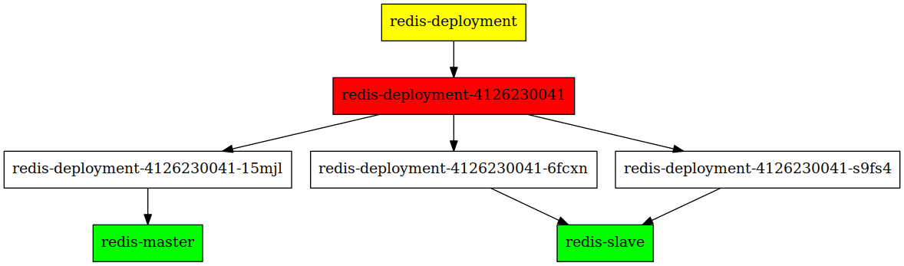
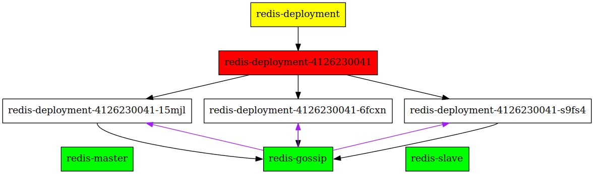
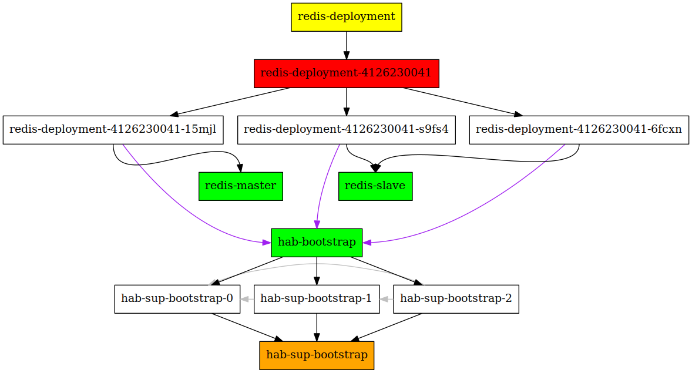

# Bootstrapping Habitat supervisors on top of kubernetes


[Habitat](http://habitat.sh) supervisors gossip with each other to support changing the
configuration during run-time, and to have support e.g. leader/follower topologies.

**TL;WR**: Setting up habitat supervisors on top of K8s is not trivial.
This project solves that via `Statefulset`s.
See the [Usage](#usage) section below on how to use it.

## Background
Let's say that we want to run a high available redis cluster.
Therefore, we opt to have a kubernetes deployment, which will create a replicaset.
The supervisors in the pods will perform leader election, after which we'll apply
the correct kubernetes labels to those pods, such that the pod that won the election will
be selected by the `redis-master` service, and the other two pods by the `redis-slave` service.



### The problem
Setting this up on kubernetes can be tricky, since habitat requires that the initial node
is started _without_ the `--peer` option. If you'd use a `ReplicaSet`, you can only create
identical pods, and therefore either all of them will have the `--peer` option, or none of them
will. In the first case, nothing will happen because the supervisor will try to join the peer node
before allowing other nodes to join it, and in the latter none will ever join, and therefore
they will not be linked to the `redis-master` and `redis-slave` services.



### The solution
Luckily kubernetes supports `StatefulSet`s, which allow pods to have stable identifier names, and
a guaranteed startup order.

The container that is generated by the `build.sh` script will run a small
[ruby script](k8s-hab-sup-bootstrap/src/sup-bootstrap-init.rb), that
determines what the arguments to the habitat supervisor must be to successfully start.

The first pod in the Statefulset (with the name `hab-sup-bootstrap-0`) will not have any
`--peer` flag, the second will point to just `hab-sup-bootstrap-0`, the third to
both `hab-sup-bootstrap-0` and `hab-sup-bootstrap-1` etc.

Our redis cluster can just point to the stable `hab-bootstrap` name to bootstrap the gossiping
(purple arrows)



### Remaining problems
AFAICS there is one remaining source of race issues. If the `hab-sup-bootstrap-0` pod dies,
and is restarted, it might take some (smallish) amount of time before the other bootstrap
supervisors notice that it's up again, and join it.

During this interval, a split-brain problem could occur.
Consider other habitat supervisors that run a leader topology, which might connect
to `hab-sup-bootstrap-0` and conclude that one of them is the leader, whilst actually there
are older pods that are just connected to `hab-sup-bootstrap-{1,2}`.

I believe this can only be fixed if the supervisors would have a flag to force connecting it to
all IP addresses that are resolved by the service IP.


# Usage
#### Prerequisites
You need to have `habitat`, `docker`, `minikube` and `kubectl` installed.

#### To test it out on minikube:

1. Start minikube `minikube start`
2. Set your `ORIGIN` env var: `export ORIGIN=my_origin`
3. Run the `build-bootstrap.sh` script.
4. Import the container in minikube:
    `docker save $ORIGIN/k8s-sup-bootstrap-init | (eval $(minikube docker-env); docker load)`
5. Apply the manifest: `kubectl apply -f bootstrap-hab-sup-on-k8s.yml`

#### Verifying that it works properly

1. Check that the statefulset is up and running.
   ```
   $ kubectl describe statefulset hab-sup-bootstrap-set
   Name:     hab-sup-bootstrap-set
   Namespace:    default
   Image(s):   moretea/k8s-sup-bootstrap-init
   Selector:   app=hab-sup-bootstrap
   Labels:     app=hab-sup-bootstrap
   Replicas:   3 current / 3 desired
   Annotations:    kubectl.kubernetes.io/last-applied-configuration={"kind":"StatefulSet","apiVersion":"apps/v1beta1","metadata":{"name":"hab-sup-bootstrap-set","creationTimestamp":null},"spec":{"replicas":3,"template":{"metadata":{"creationTimestamp":null,"labels":{"app":"hab-sup-bootstrap"}},"spec":{"containers":[{"name":"sup-bootstrap","image":"moretea/k8s-sup-bootstrap-init","env":[{"name":"HAB_PACKAGE_NAME","value":"moretea/k8s-sup-bootstrap"},{"name":"SERVICE_NAME","value":"hab-bootstrap"},{"name":"STATEFULSET_NAME","value":"hab-sup-bootstrap-set"},{"name":"POD_IP","valueFrom":{"fieldRef":{"apiVersion":"v1","fieldPath":"status.podIP"}}},{"name":"POD_NAME","valueFrom":{"fieldRef":{"fieldPath":"metadata.name"}}}],"resources":{},"imagePullPolicy":"Never"}],"terminationGracePeriodSeconds":10}},"serviceName":"hab-bootstrap"},"status":{"replicas":0}}
   CreationTimestamp:  Thu, 23 Mar 2017 09:37:16 +0100
   Pods Status:    3 Running / 0 Waiting / 0 Succeeded / 0 Failed
   No volumes.
   Events:
     FirstSeen LastSeen  Count From    SubObjectPath Type    Reason      Message
     --------- --------  ----- ----    ------------- --------  ------      -------
     6m    6m    1 {statefulset }      Normal    SuccessfulCreate  pet: hab-sup-bootstrap-set-0
     6m    6m    1 {statefulset }      Normal    SuccessfulCreate  pet: hab-sup-bootstrap-set-1
     6m    6m    1 {statefulset }      Normal    SuccessfulCreate  pet: hab-sup-bootstrap-set-2
   ```

   The important line here is the "Pod Status", it should print "3 Running"

2. The second step is to verify that the Habitat supervisors are gossiping with each other.

   Prerequisites: have `curl` and `jq` installed.

   - In one terminal, run `kubectl port-forward hab-sup-bootstrap-set-0 9631`
   - In another, `curl -s localhost:9631/butterfly | jq ".service.list[] | length"`.
     This should print out `3`.
